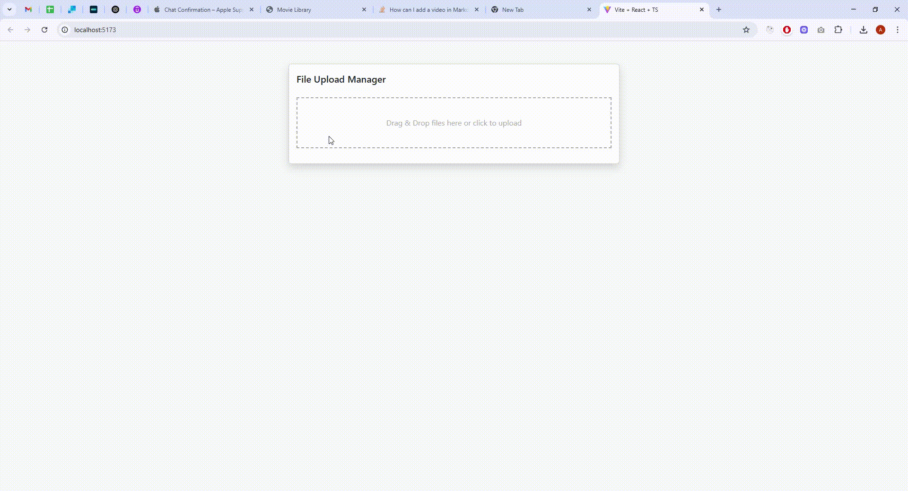

# File Uploader React Plugin

This is a reusable, modern React + TypeScript file uploader component designed to be bundled as an npm package. It enables users to upload, preview, and delete files through an intuitive, accessible interface.

## 📺 Project Demo

- **Full Project Overview:**  
  
   [Watch Preview](./doc/file-uploader-package.mp4)

## Features

- Drag & drop file upload and file selector support
- File type and size validation (supports `.jpg`, `.jpeg`, `.png`, `.txt`, `.pdf` up to 6MB)
- Duplicate file detection with overwrite confirmation
- Persistent storage using `localStorage`
- File deletion from preview and storage
- Responsive and accessible UI

## Project Structure

```
.
├── Example Project/                # Usage example consuming this plugin
│   ├── src/
│   │   ├── App.tsx                 # Demonstrates plugin usage
│   └── ...
├── src/                            # Source code for the file-uploader-plugin
│   ├── components/
│   │   ├── FilesSave.tsx
│   │   ├── PreviewFiles.tsx
│   │   └── RenderPreviewContent.tsx
│   └── index.tsx                   # Entry point of the plugin
├── rollup.config.mjs               # Bundler config for package build
├── package.json                    # Package metadata and dependencies
├── tsconfig.json                   # TypeScript configuration
├── README.md                       # You’re reading this!
└── .gitignore
```

## About the Plugin

- `file-uploader-plugin` is designed to be installed via npm (or used locally).
- It is published as a standalone package, and can be imported into any React project.
- The plugin is built with Rollup for optimized bundling.

## Development

### Install dependencies

```sh
npm install
```

### Build the package

```sh
npm run build
```

This will output the compiled code into the dist/ folder, ready for publishing or installation.

## Publishing to npm

To publish a new version of the plugin:

1. Update the version number in `package.json`:

    ```sh
   version: "2.7.0"     // ← Update this before publishing
   ```

2. Build and publish:

    ```sh
    npm run build
    npm login
    npm publish
   ```

3. Consumers can now install the latest version via:

    ```sh
    npm install file-uploader-plugin
    ```

4. If you're testing locally in a sub-project like Example Project, install the plugin using a relative path instead:

    ```sh
    npm install ../
    ```

## Testing the Plugin Locally

To test this plugin inside your [`Example Project`](Example%20Project) without publishing:

1. Build the plugin:

    ```sh
    npm run build
    ```

2. Navigate to the example project

    ```sh
    cd 'Example Project'
    ```

3. Install the plugin locally:

    ```sh
    npm install ../
    ```

4. Use the plugin as

    ```sh
    import FileUpload as 'file-uploader-plugin';
    ```

## License

© 2025 **Sumedha Softech Pvt. Ltd.** All rights reserved.

---

**Author:** Aman Sharma
**Orgination:** Sumedha Softech Pvt. Ltd.